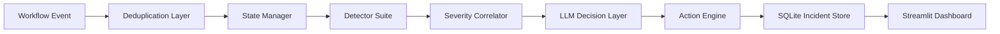

# AI Workflow Exception Handler

An AI-powered exception handling system for event-driven workflows. The project detects anomalies in workflow events, correlates multiple detector signals into a severity score, asks an LLM for root-cause analysis and remediation guidance, executes safe remediation actions, and visualizes incidents in an interactive Streamlit dashboard.

## Why This Project Matters

Modern workflow systems often fail in subtle ways: missing payload fields, unexpected event order, latency spikes, heartbeat gaps, and sudden volume surges. This project shows how those signals can be detected, scored, explained, and acted on through an AI-assisted incident response pipeline.

It is designed as a practical engineering demo with clear modules, local persistence, tests, and a dashboard that makes the system easy to present.

## Features

- Real-time workflow event processing
- Schema validation for required event payload fields
- Sequence checking for invalid workflow transitions
- Latency profiling by workflow step
- Heartbeat gap detection
- Volume surge detection
- Weighted anomaly severity correlation
- RAG-style incident memory that retrieves similar historical incidents for LLM context
- LLM-based root cause analysis and suggested remediation
- Action engine for retry, escalation, compensation, or skip decisions
- Agentic recovery verification after remediation actions
- Local SQLite incident storage
- Interactive Streamlit dashboard with filters, charts, drill-downs, persistent triage notes, manual actions, and CSV export
- Unit tests for detectors, scoring, state management, deduplication, and actions

## Architecture



## Project Structure

```text
ai-workflow-exception-handler/
  src/
    actions/              # Remediation action execution and recovery verification
    cloud/                # SQLite incident logger
    dashboard/            # Compatibility logging module for demo pipeline
    detectors/            # Schema, sequence, heartbeat, latency, volume detectors
    llm/                  # LLM prompt and decision parsing
    memory/               # Similar incident retrieval for LLM context
    pipeline/             # Main exception handling pipeline
    scoring/              # Signal correlation and severity scoring
    state/                # Workflow state and deduplication
    types/                # Pydantic models
    demo.py               # Demo event stream
    streamlit_dashboard.py# Interactive dashboard
  tests/                  # Pytest unit tests
  requirements.txt
```

## Setup

1. Clone or open the project folder.

```powershell
cd "C:\Users\ghsingh\ai-workflow-exception-handler"
```

2. Install dependencies.

```powershell
python -m pip install -r requirements.txt
```

3. Create a `.env` file from the example.

```powershell
copy .env.example .env
```

4. Add your Groq API key inside `.env`.

```text
GROQ_API_KEY=your_key_here
```

You can also set the key directly in PowerShell for the current terminal session:

```powershell
$env:GROQ_API_KEY="your_key_here"
```

If `.env` is empty but the terminal environment variable is set, the demo can still work in that same PowerShell session.

## Run the Demo

Start the demo event generator:

```powershell
python src\demo.py
```

The demo sends sample workflow events through the exception handling pipeline. Incidents are saved into `incidents.db`.

## Run the Dashboard

Open a second PowerShell window and run:

```powershell
python -m streamlit run src\streamlit_dashboard.py
```

Then open:

```text
http://localhost:8501
```

## Run Tests

```powershell
python -m pytest -q
```

Current test coverage includes:

- Schema validation
- Latency detection
- Volume surge detection
- Sequence checking
- Weighted severity correlation
- State manager behavior
- Deduplication
- Action engine retry/escalate behavior

## Example Workflow

1. `demo.py` emits workflow events.
2. The pipeline records state and runs detector checks.
3. Triggered detector signals are correlated into an overall severity score.
4. Similar past incidents are retrieved from SQLite and added as LLM context.
5. The LLM decision layer explains the probable root cause and suggests an action.
6. The action engine executes a safe remediation action.
7. The recovery verifier marks the incident as recovered, still failing, needs human review, or not attempted.
8. Incident details are saved to SQLite.
9. The Streamlit dashboard displays severity trends, action breakdowns, detector frequency, heatmaps, recovery status, persistent triage notes, manual actions, and incident-level drill-downs.

## Tech Stack

- Python
- Streamlit
- SQLite
- Pandas
- Plotly
- Pydantic
- Groq LLM API
- Pytest

## Roadmap

- Upgrade incident memory to vector embeddings for deeper semantic retrieval
- Add user authentication and role-based incident ownership
- Add GitHub Actions for automated test runs
- Add richer incident replay and self-healing verification loop
- Add Docker support for easier deployment

## Notes

The local database, API keys, cache folders, and service account files are intentionally ignored by Git. `serviceAccount.json` can remain important for your local setup, but it should stay private and should not be committed. Keep secrets in `.env` or terminal environment variables and never commit them.


